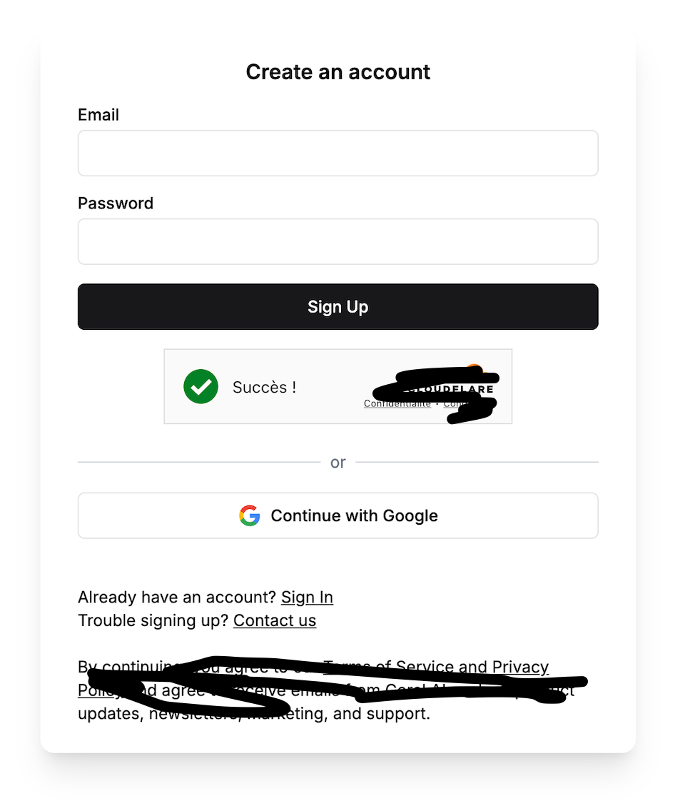
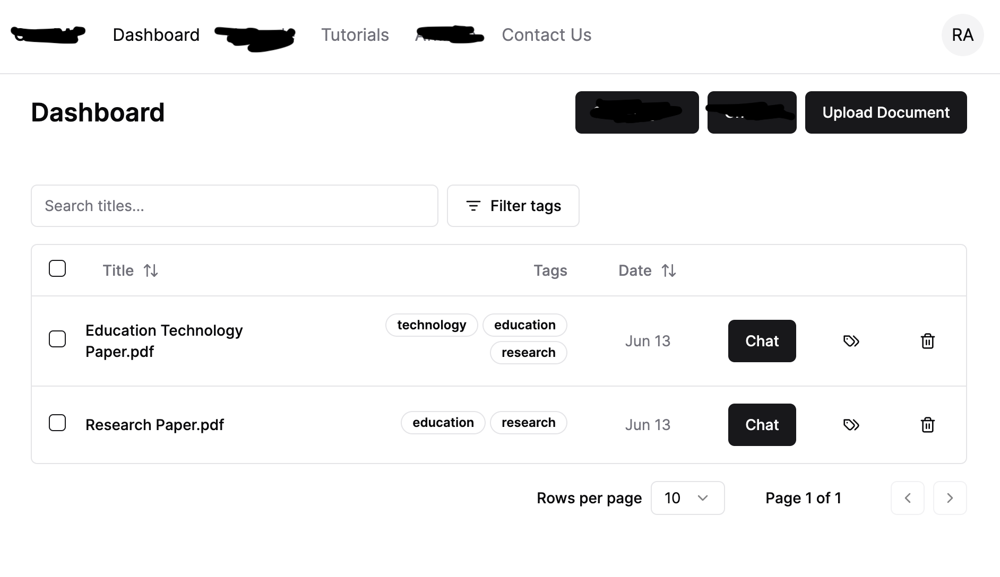
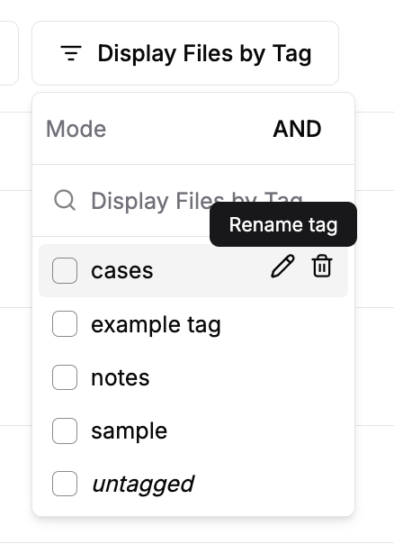
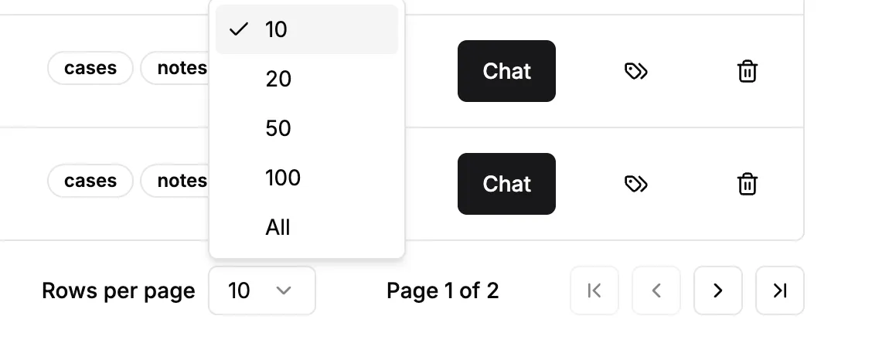
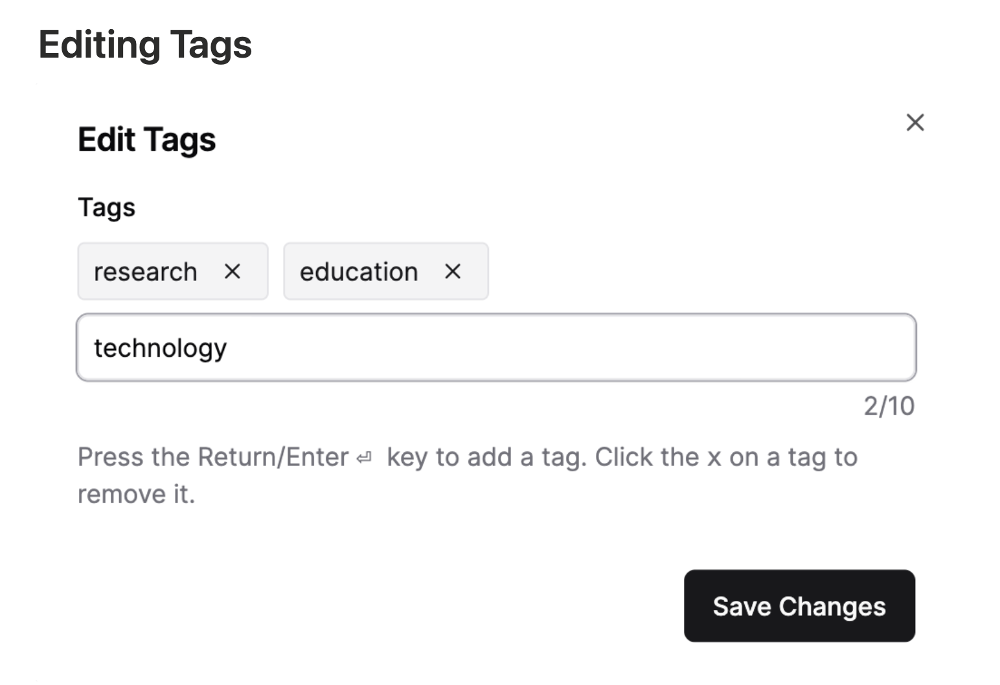
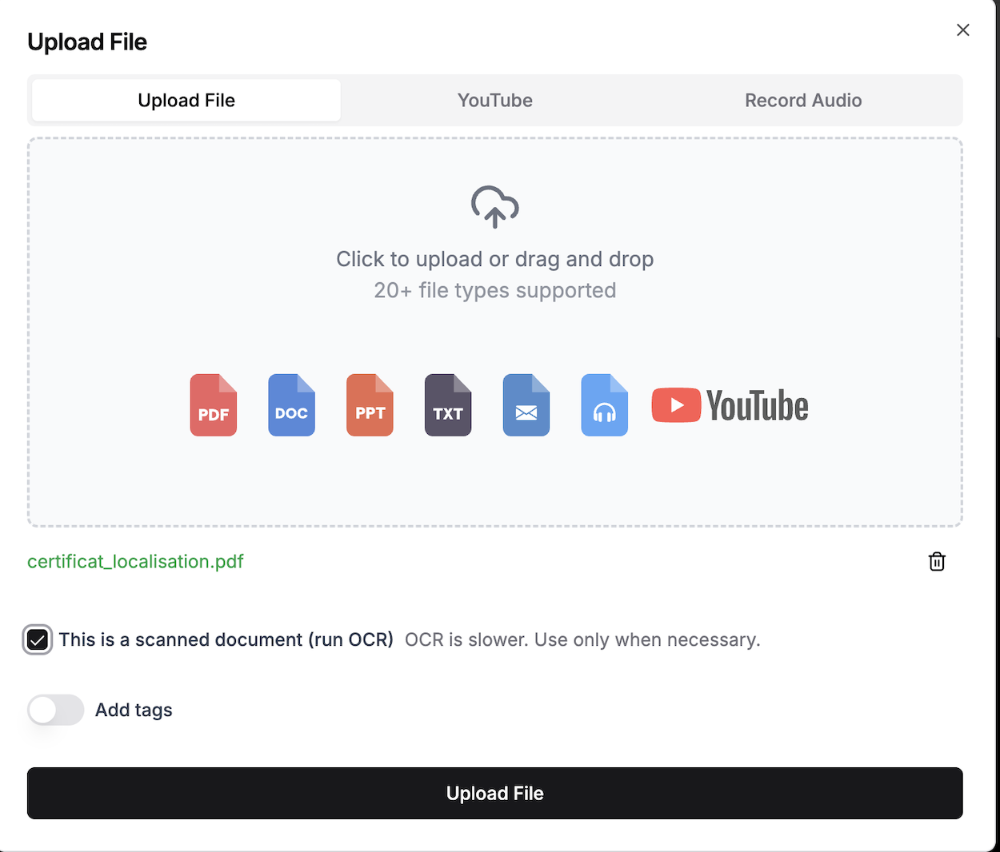
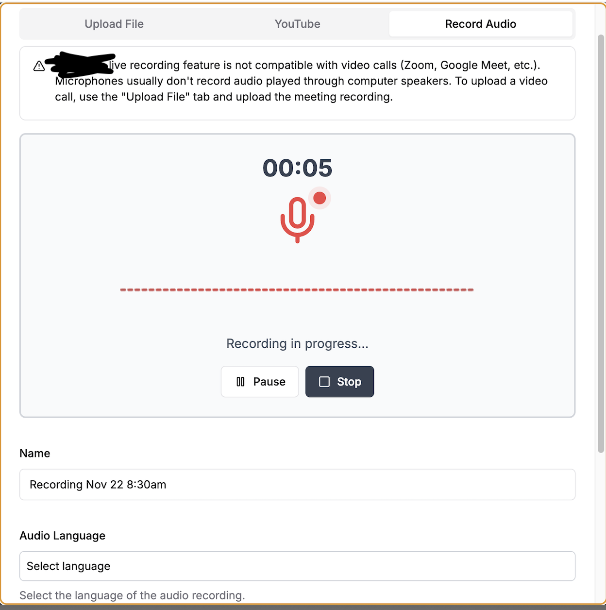
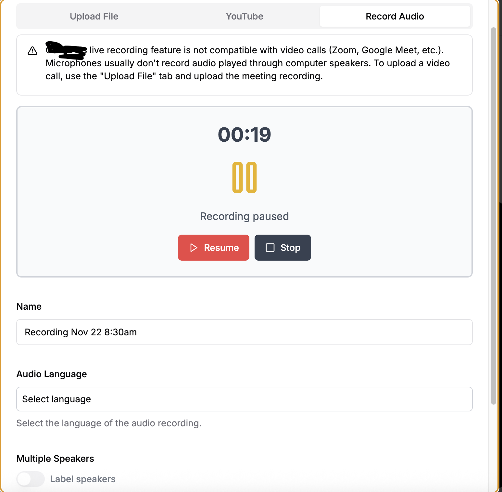
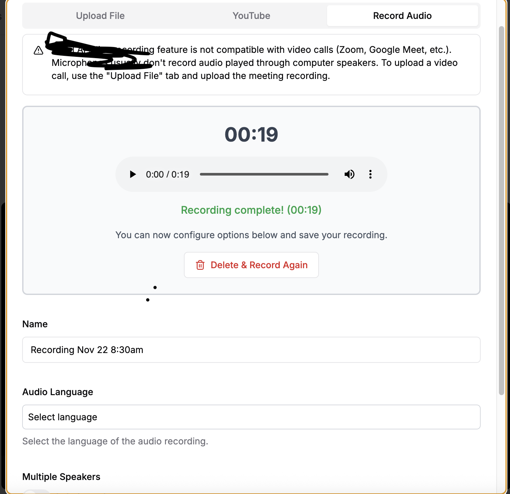
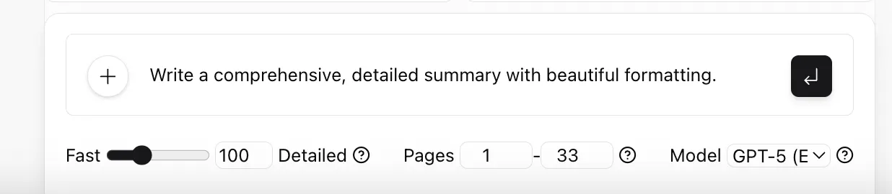

# Notary - Spécifications fonctionnelles pour développement

Ce document décrit les spécifications fonctionnelles détaillées pour le développement de l'application Web **Notary**, destinée aux notaires du Québec.

Si ce document contient des incohérences ou des points à clarifier, merci de
me le signaler.

## 1. Vue d'ensemble et contexte

**Notary** est une application Web destinée aux notaires du Québec pour la gestion intelligente de leurs dossiers avec l'assistance de l'intelligence artificielle.

### Objectif du prototype
Développer une application fonctionnelle permettant aux notaires de:
- Gérer leurs dossiers de manière organisée
- Téléverser et organiser des documents
- Interagir avec un LLM pour analyser les dossiers, détecter des incohérences, identifier des documents manquants et générer des actes notariaux
- Transcrire et analyser des enregistrements audio
- Suivre l'avancement de leurs dossiers


## 2. Structure de navigation et sitemap

### Architecture de l'application

```
┌─────────────────────────────────────────────────────┐
│                  Page de connexion                   │
│               /login ou /register                    │
└────────────────────┬────────────────────────────────┘
                     │
                     ↓
┌─────────────────────────────────────────────────────┐
│                    Dashboard                         │
│                   / (page d'accueil)                 │
│  ┌──────────────────────────────────────────────┐   │
│  │  • Liste des dossiers avec filtres           │   │
│  │  • Recherche globale                         │   │
│  │  • Actions: Nouveau dossier, Upload         │   │
│  └──────────────────────────────────────────────┘   │
└────────────────────┬────────────────────────────────┘
                     │
                     ↓
┌─────────────────────────────────────────────────────┐
│              Détail d'un dossier                     │
│                /cases/:id                            │
│  ┌──────────────────────────────────────────────┐   │
│  │  Onglet: Aperçu                              │   │
│  │  • Informations du dossier                   │   │
│  │  • Parties impliquées                        │   │
│  │  • Dates importantes                         │   │
│  │  • Notes privées                             │   │
│  │  • Statut du dossier                         │   │
│  └──────────────────────────────────────────────┘   │
│  ┌──────────────────────────────────────────────┐   │
│  │  Onglet: Documents                           │   │
│  │  • Liste des documents                       │   │
│  │  • Viewer de documents                       │   │
│  │  • Upload de documents                       │   │
│  └──────────────────────────────────────────────┘   │
│  ┌──────────────────────────────────────────────┐   │
│  │  Onglet: Assistant IA                        │   │
│  │  • Chat avec LLM                             │   │
│  │  • Sélection de modèle                       │   │
│  │  • Prompts prédéfinis                        │   │
│  │  • Historique des conversations              │   │
│  └──────────────────────────────────────────────┘   │
│  ┌──────────────────────────────────────────────┐   │
│  │  Onglet: Analyse (nouveau)                   │   │
│  │  • Résumé du dossier généré par IA           │   │
│  │  • Documents manquants                       │   │
│  │  • Incohérences détectées                    │   │
│  │  • Actions recommandées                      │   │
│  └──────────────────────────────────────────────┘   │
└─────────────────────────────────────────────────────┘
```

### Navigation globale

**Header présent sur toutes les pages (sauf login):**
- Logo Notary (clic → retour au Dashboard)
- Barre de recherche globale
- Bouton "Nouveau dossier"
- Menu utilisateur (avatar/initiales)
  - Mon profil
  - Paramètres
  - Déconnexion

**Actions rapides (floating action buttons ou toolbar):**
- Upload rapide de document
- Nouveau dossier
- Nouvelle note


## 3. Pages et composants détaillés

### 3.1 Page de connexion / Inscription

La première page du site Web de Notary est la page de connexion.
Le formulaire de connexion pourrait ressembler à ceci :



#### Layout

Cette page serait divisée en deux sections :
- Présentation de l'application à gauche
- Formulaire de connexion à droite
- Card avec ombre portée
- Logo Notary en haut

#### Formulaire de connexion

**Champs:**
- **Email**
  - Type: email
  - Placeholder: "votre@email.com"
  - Obligatoire
  - Validation: format email valide
  
- **Mot de passe**
  - Type: password
  - Placeholder: "••••••••"
  - Obligatoire
  - Icône œil pour afficher/masquer
  - Validation: minimum 8 caractères

**Boutons:**
- **"Sign In"** (bouton principal, pleine largeur)
  - États: default, hover, loading, disabled
  - Loading: spinner + texte "Connexion..."
  
- **"Continue with Google"** (bouton secondaire avec icône Google)
  - Optionnel pour le prototype

**Liens:**
- "Créer un compte" → bascule vers formulaire d'inscription
- "Mot de passe oublié?" → (peut être un placeholder pour le prototype)
- "Contactez-nous" → lien externe ou page de contact


L'utilisateur doit pouvoir choisir sa langue préférée (français/anglais) via un sélecteur en haut à droite.


#### Formulaire d'inscription

**Champs supplémentaires:**
- **Nom complet**
  - Obligatoire
  - Placeholder: "Jean Tremblay"
  
- **Confirmation du mot de passe**
  - Doit correspondre au mot de passe
  
- **Checkbox "J'accepte les conditions d'utilisation"**
  - Obligatoire pour soumettre

**Bouton:**
- "Créer mon compte"

#### États et messages

**État loading:**
- Bouton désactivé avec spinner
- Formulaire désactivé

**Messages de succès:**
- "Compte créé avec succès ! Connexion en cours..."
- Redirection automatique après 2 secondes

**Messages d'erreur:**
- Email déjà utilisé: "Cet email est déjà associé à un compte"
- Mot de passe incorrect: "Email ou mot de passe incorrect"
- Erreur serveur: "Une erreur est survenue. Veuillez réessayer."
- Format email invalide: "Veuillez entrer une adresse email valide"
- Mot de passe trop court: "Le mot de passe doit contenir au moins 8 caractères"
- Mots de passe non concordants: "Les mots de passe ne correspondent pas"

**Affichage des erreurs:**
- Sous le champ concerné en rouge
- Icône d'alerte
- Bordure rouge sur le champ en erreur

#### Flux utilisateur - Connexion

```
1. Utilisateur arrive sur la page de connexion
2. Remplit email et mot de passe
3. Clique sur "Sign In"
   → Validation des champs
   → Si invalide: affichage erreurs
   → Si valide: 
     - Bouton passe en état loading
     - Appel API de connexion
     - Si succès: redirection vers Dashboard
     - Si échec: affichage message d'erreur
```


### 3.2 Dashboard (Liste des dossiers)


Les dossiers créés seraient affichés dans une liste. 

De plus, l'utilisateur pourrait filtrer les dossiers par "tags" comme ceci :



Je ne connais pas la traduction française de "tags". Peut-être "catégories"? As-tu une meilleure idée?


L'utilisateur pourrait filtrer les dossiers par catégorie, comme ceci :



Évidemment, au lieu de voir "cases", "notes"...", on verrait les catégories pertinentes pour un notaire au Québec.


#### Layout

**Header de page:**
- Titre: "Mes dossiers" ou "Dashboard"
- Boutons d'action:
  - "Nouveau dossier" (bouton principal)
  - "Nouveau mémo" (bouton secondaire - nouveau)
  - "Upload document" (bouton secondaire)

**Barre de recherche et filtres:**
```
┌────────────────────────────────────────────────────┐
│  🔍 [Rechercher dans les dossiers...]   [Filtrer] │
└────────────────────────────────────────────────────┘
```

**Options de filtrage:**
- Bouton "Filtrer par tags" → ouvre modal de sélection des tags
- Bouton "Statut" → dropdown: Tous, Actifs, Complétés, Archivés (nouveau)
- Bouton "Priorité" → dropdown: Haute, Moyenne, Basse
- Bouton "Épinglés" → toggle on/off
- Bouton "Tri" → dropdown: Plus récent, Plus ancien, A-Z, Z-A

#### Tableau des dossiers

**Colonnes:**
1. **Checkbox** - Sélection multiple
2. **Icône + Titre du dossier**
   - Icône selon type de dossier (nouveau):
     - 🏠 Immobilier
     - 📜 Testament
     - 💼 Entreprise
     - 👥 Famille
     - 📋 Autre
3. **Statut** (nouveau)
   - Badge coloré:
     - Nouveau (bleu)
     - En cours (orange)
     - En attente (jaune)
     - Complété (vert)
     - Archivé (gris)
4. **Tags**
   - Badges de catégories
   - Max 3 visibles, "..." si plus
5. **Parties** (nouveau)
   - Noms des clients principaux
   - "Jean Tremblay, Marie Dubois"
6. **Date de création**
   - Format: "13 juin 2024" ou "Il y a 2 jours"
7. **Dernière modification** (nouveau)
   - "Il y a 3 heures"
8. **Actions**
   - Bouton "Chat" (ouvre l'assistant IA)
   - Bouton "Épingler/Désépingler"
   - Bouton "..." (menu contextuel)
     - Modifier
     - Dupliquer
     - Archiver
     - Supprimer

#### Dossiers épinglés (nouveau)

**Section au-dessus du tableau:**
- "Dossiers épinglés" (titre)
- Affichage en cards horizontales (max 5)
- Accès rapide aux dossiers prioritaires

```
┌─────────────────┐  ┌─────────────────┐  ┌─────────────────┐
│ 📌 Vente Dupont │  │ 📌 Testament X  │  │ 📌 Hypo. Martin │
│ En cours        │  │ En attente      │  │ Complété        │
│ 3 docs          │  │ 5 docs          │  │ 12 docs         │
└─────────────────┘  └─────────────────┘  └─────────────────┘
```

#### Pagination et affichage

**Contrôles en bas du tableau:**
```
┌────────────────────────────────────────────────────┐
│  Lignes par page: [10 ▼]    Page 1 sur 3    ⟨ ⟩ │
└────────────────────────────────────────────────────┘
```

**Options de "Lignes par page":**
- 10
- 20
- 50
- 100
- Tous


L'utilisateur pourrait choisir de présenter 10, 20, 50, 100 ou tous les dossiers dans la page, comme ceci :




#### États de l'interface

**État initial (chargement):**
- Skeleton loader sur 5 lignes du tableau
- Animation de chargement

**État vide (aucun dossier):**
```
┌────────────────────────────────────────────────────┐
│               📁                                    │
│     Aucun dossier pour le moment                   │
│                                                     │
│   Créez votre premier dossier pour commencer       │
│                                                     │
│        [+ Créer un dossier]                        │
└────────────────────────────────────────────────────┘
```

**État avec recherche sans résultat:**
```
┌────────────────────────────────────────────────────┐
│               🔍                                    │
│     Aucun dossier trouvé                           │
│                                                     │
│   Essayez avec d'autres mots-clés                  │
│                                                     │
│        [Effacer la recherche]                      │
└────────────────────────────────────────────────────┘
```

**État d'erreur:**
```
┌────────────────────────────────────────────────────┐
│               ⚠️                                    │
│     Impossible de charger les dossiers             │
│                                                     │
│   Une erreur est survenue lors du chargement       │
│                                                     │
│           [Réessayer]                              │
└────────────────────────────────────────────────────┘
```

#### Sélection multiple

**Actions disponibles quand dossiers sélectionnés:**
- Barre d'action apparaît en haut:
```
┌────────────────────────────────────────────────────┐
│  ✓ 3 dossiers sélectionnés                         │
│  [Ajouter tags] [Archiver] [Supprimer] [Annuler]  │
└────────────────────────────────────────────────────┘
```

#### Interactions

**Clic sur une ligne de dossier:**
- Ouvre la page de détail du dossier (onglet Aperçu)

**Hover sur une ligne:**
- Fond légèrement grisé
- Actions deviennent plus visibles

**Clic sur un tag:**
- Applique automatiquement ce tag comme filtre

#### Recherche globale

**Fonctionnement:**
- Recherche en temps réel (debounce 300ms)
- Recherche dans:
  - Titre des dossiers
  - Noms des parties
  - Tags
  - Notes
  - Contenu des documents (si indexé)
  
**Affichage des résultats:**
- Highlight des mots recherchés
- Indication de où le match a été trouvé ("Trouvé dans: Notes")

#### Flux utilisateur - Créer un dossier

```
1. Clic sur "Nouveau dossier"
2. Modal s'ouvre avec formulaire
3. Remplir les champs:
   - Titre du dossier (obligatoire)
   - Type de dossier (dropdown)
   - Description (optionnelle)
   - Parties impliquées (optionnel, peut être ajouté après)
   - Tags (optionnel)
4. Clic sur "Créer"
   → Validation des champs
   → Si invalide: affichage erreurs
   → Si valide:
     - Modal en état loading
     - Appel API
     - Toast de succès: "Dossier créé avec succès"
     - Redirection vers le détail du nouveau dossier
```


### 3.3 Modal de création de dossier (nouveau)

**Déclenchement:**
- Bouton "Nouveau dossier" depuis n'importe où dans l'app

#### Formulaire

**Champs:**

1. **Titre du dossier***
   - Input text
   - Placeholder: "Ex: Vente immobilière - Famille Tremblay"
   - Obligatoire
   - 3-200 caractères
   - Validation en temps réel

2. **Type de dossier***
   - Dropdown
   - Options:
     - 🏠 Immobilier
       - Vente
       - Achat
       - Hypothèque/Refinancement
     - 📜 Succession et testament
       - Testament
       - Liquidation successorale
       - Mandat de protection
     - 👥 Droit de la famille
       - Contrat de mariage
       - Convention de vie commune
       - Convention de séparation
     - 💼 Droit des affaires
       - Incorporation
       - Convention d'actionnaires
       - Vente/Achat d'entreprise
     - 📋 Autre


Les grandes catégories de sujets traités par un notaire au Québec pourraient être les suivantes :

**Droit immobilier**
- Achat et vente de propriétés
- Hypothèques et refinancement
- Servitudes et droits de passage

**Planification successorale et testamentaire**
- Rédaction de testaments
- Planification fiscale successorale
- Fiducies testamentaires

**Successions**
- Liquidation de successions
- Recherche testamentaire
- Partage des biens

**Mandats de protection**
- Mandat en cas d'inaptitude
- Régimes de protection (tutelle, curatelle)

**Droit de la famille**
- Contrats de mariage
- Conventions de vie commune (union de fait)
- Conventions de séparation
- Donations entre conjoints

**Droit des affaires**
- Incorporation de compagnies
- Conventions entre actionnaires
- Vente et achat d'entreprises
- Baux commerciaux

**Donations**
- Donations entre vifs
- Donations immobilières

**Procurations**
- Procurations générales ou spécifiques

**Authentification de documents**
- Copies conformes
- Affidavits et déclarations sous serment

Le notaire agit comme officier public et ses actes ont une valeur probante particulière, ce qui les rend difficilement contestables devant les tribunaux.

Faudrait pouvoir gérer ces catégories (ajout, retrait, modification) avec un formulaire prévu à cet effet.


3. **Numéro de dossier** (nouveau)
   - Input text
   - Placeholder: "2024-001"
   - Optionnel
   - Auto-généré si laissé vide
   - Unique dans le système

4. **Description**
   - Textarea
   - Placeholder: "Décrivez brièvement le dossier..."
   - Optionnel
   - Max 500 caractères
   - Compteur de caractères affiché

5. **Parties principales** (nouveau)
   - Champ multi-entrées
   - Ajouter avec bouton "+"
   - Pour chaque partie:
     - Nom complet
     - Rôle (dropdown: Acheteur, Vendeur, Testateur, Légataire, etc.)
     - Email (optionnel)
     - Téléphone (optionnel)

6. **Date de signature prévue** (nouveau)
   - Date picker
   - Optionnel
   - Permet d'ajouter à l'échéancier

7. **Tags**
   - Multi-select avec création à la volée
   - Taper + Enter pour ajouter
   - Suggestions basées sur tags existants

**Boutons:**
- "Annuler" (secondaire)
- "Créer le dossier" (primaire)

#### Validation

**Champs obligatoires:**
- Titre (min 3 caractères)
- Type de dossier

**Messages d'erreur:**
- Titre vide: "Le titre du dossier est obligatoire"
- Titre trop court: "Le titre doit contenir au moins 3 caractères"
- Type non sélectionné: "Veuillez sélectionner un type de dossier"
- Numéro de dossier déjà utilisé: "Ce numéro de dossier existe déjà"


### 3.4 Gestion des tags


L'utilisateur pourrait éditer les catégories disponibles, comme ceci :




#### Modal "Filtrer par tags"

**Référence:** Page 3 du PDF (interface "Display Files by Tag")

**Déclenchement:**
- Bouton "Filtrer par tags" dans le Dashboard

**Contenu du modal:**

**Header:**
- Titre: "Filtrer les dossiers par tags"
- Bouton de fermeture (X)

**Mode de filtrage:**
```
Mode:  ( ) ET    (•) OU
```
- **Mode ET:** Dossiers ayant TOUS les tags sélectionnés
- **Mode OU:** Dossiers ayant AU MOINS UN des tags sélectionnés

**Barre de recherche:**
- Placeholder: "Rechercher un tag..."
- Filtrage en temps réel de la liste

**Liste des tags:**
- Checkbox pour chaque tag
- Nom du tag
- Compteur: "Immobilier (23)" - nombre de dossiers
- Icônes d'action (visible au hover):
  - ✏️ Renommer
  - 🗑️ Supprimer

**Tag spécial:**
- "Sans tag" (checkbox) - pour afficher les dossiers sans aucun tag

**Boutons du footer:**
- "Effacer" (réinitialiser tous les filtres)
- "Annuler"
- "Appliquer les filtres" (primaire)

#### Modal "Gérer les tags"

**Référence:** Page 6 du PDF (interface "Edit Tags")

**Déclenchement:**
- Bouton "Gérer mes tags" dans les paramètres
- Ou depuis la liste des tags → "..." → "Gérer tous les tags"

**Contenu:**

**Tags existants:**
- Affichage en chips/badges
- Bouton X pour supprimer (avec confirmation)
- Clic sur le tag → mode édition inline

**Ajouter un nouveau tag:**
```
┌────────────────────────────────────────────┐
│  [Nom du tag____________]  [Couleur: 🎨]  │
│                                    2/50     │
└────────────────────────────────────────────┘
```
- Input pour le nom (max 50 caractères)
- Sélecteur de couleur (palette prédéfinie)
- Appuyer sur Enter pour ajouter
- Compteur de caractères

**Instructions:**
"Appuyez sur Enter pour ajouter un tag. Cliquez sur le X pour supprimer un tag."

**Boutons:**
- "Annuler"
- "Enregistrer les modifications"

#### Tags prédéfinis pour notaires (suggestions initiales)

**Catégories suggérées au premier lancement:**

**Par type d'acte:**
- Vente immobilière
- Achat immobilier
- Hypothèque
- Refinancement
- Testament
- Succession
- Mandat de protection
- Contrat de mariage
- Union de fait
- Séparation
- Incorporation
- Convention d'actionnaires
- Donation

**Par statut:**
- Urgent
- Priorité haute
- En attente client
- En attente documents
- Prêt pour signature
- À réviser

**Autres:**
- Premier acheteur
- Promesse d'achat signée
- Financement approuvé
- Inspections complétées

#### Validation et règles

**Création de tag:**
- Min 2 caractères
- Max 50 caractères
- Pas de doublons (insensible à la casse)
- Caractères alphanumériques, espaces, tirets

**Suppression de tag:**
- Modal de confirmation:
  "Supprimer le tag 'Immobilier'? Ce tag sera retiré de X dossiers."
  - [Annuler] [Supprimer]

**Renommer un tag:**
- Modal ou édition inline
- Même validation qu'à la création
- Impact sur tous les dossiers utilisant ce tag
- Confirmation: "Ce tag sera renommé dans X dossiers"

#### Flux utilisateur - Filtrer par tags

```
1. Clic sur "Filtrer par tags"
2. Modal s'ouvre avec liste des tags
3. Sélectionner un ou plusieurs tags (checkboxes)
4. Choisir mode ET ou OU
5. (Optionnel) Rechercher un tag spécifique
6. Clic sur "Appliquer les filtres"
   → Modal se ferme
   → Liste des dossiers se met à jour
   → Badge de filtre actif s'affiche:
     "Filtres: Immobilier, Testament (×)"
   → Clic sur (×) pour retirer le filtre
```


### 3.5 Upload de documents


Permettre de téléverser des documents PDF, Word, etc.
Ce formulaire pourrait ressembler à ceci :



Prévoir 2 onglets : Téléverser des fichiers, Enregistrement audio. Ne pas ajouter l'onglet "Youtube".

L'utilisateur pourrait téléverser de nombreux types de fichiers, notamment :
- Documents Word (.doc, .docx)
- PDFs (.pdf)
- Présentations PowerPoint (.ppt, .pptx)
- Fichiers texte (.txt, .rtf)
- Fichiers Markdown (.md)
- Fichiers audio (.mp3, .mp4, .mp2, .aac, .wav, .flac, .pcm, .m4a, .ogg, .opus, .webm, et plus encore.)

Si vous avez un PDF scanné, nous disposons également de l'OCR (cela fonctionne même sur l'écriture manuscrite !)

Lorsque l'utilisateur téléverse des fichiers, une case à cocher demande si le document a été scanné nécessitant un parsing avec OCR.


#### Modal d'upload

**Déclenchement:**
- Bouton "Upload document" dans le header global
- Bouton "Téléverser" dans l'onglet Documents d'un dossier
- Drag & drop de fichier n'importe où sur la page d'un dossier

**Structure du modal:**
- Large (900px de largeur recommandée)
- 2 onglets: "Téléverser des fichiers" | "Enregistrement audio"
- ⚠️ **Important:** Pas d'onglet "YouTube" (comme mentionné dans le PDF)

#### Onglet 1: Téléverser des fichiers

**Référence:** Page 7 du PDF

**Zone de drop:**
```
┌─────────────────────────────────────────────────────┐
│                       ☁️↑                           │
│                                                      │
│     Cliquez pour téléverser ou glissez-déposez      │
│                                                      │
│           Plus de 20 types de fichiers supportés    │
│                                                      │
│     📄 PDF   📘 DOC   📊 PPT   📝 TXT   📧 Email   │
│                    🎵 Audio                         │
└─────────────────────────────────────────────────────┘
```

**Types de fichiers supportés:**
- Documents: .pdf, .doc, .docx, .txt, .rtf, .md
- Présentations: .ppt, .pptx
- Tableurs: .xls, .xlsx (nouveau)
- Images: .jpg, .jpeg, .png (nouveau - pour plans, photos de propriété)
- Audio: .mp3, .mp4, .m4a, .wav, .webm, .ogg, .opus, etc.

**Taille maximale:** 100 MB par fichier

**Liste des fichiers en attente:**
Après sélection, avant upload final:
```
┌─────────────────────────────────────────────────────┐
│  📄 certificat_localisation.pdf        1.2 MB    🗑️ │
│  📘 contrat_achat.docx                 245 KB    🗑️ │
│  🎵 rencontre_client.mp3               8.5 MB    🗑️ │
└─────────────────────────────────────────────────────┘
```
- Icône du type de fichier
- Nom du fichier (éditable - clic pour renommer)
- Taille
- Bouton supprimer (avant upload)

**Options:**

1. **Document scanné (OCR)**
   ```
   ☑️ Ceci est un document scanné (exécuter l'OCR)
      ℹ️ L'OCR est plus lent. Utilisez uniquement si nécessaire.
   ```
   - Checkbox désactivée par défaut
   - Info tooltip sur le temps de traitement

2. **Type de document** (nouveau)
   ```
   Type de document: [Sélectionner ▼]
   ```
   - Dropdown avec catégories:
     - Pièce d'identité
     - Titre de propriété
     - Certificat de localisation
     - Évaluation municipale
     - Offre d'achat
     - Rapport d'inspection
     - Document bancaire
     - Contrat
     - Correspondance
     - Autre

3. **Ajouter des tags**
   ```
   ⚪ Ajouter des tags
   ```
   - Toggle pour afficher champ de tags
   - Même fonctionnement que tags de dossiers

**Boutons d'action:**
- "Annuler" (secondaire)
- "Téléverser les fichiers" (primaire, désactivé si aucun fichier)

**Barre de progression pendant l'upload:**
```
┌─────────────────────────────────────────────────────┐
│  📄 certificat_localisation.pdf                     │
│  ▓▓▓▓▓▓▓▓▓▓░░░░░░░░░░ 45%                          │
└─────────────────────────────────────────────────────┘
```

#### Onglet 2: Enregistrement audio


Par contre, si l'utilisateur charge un fichier audio, faudrait lui permettre d'indiquer la langue de l'audio (français, anglais, autres), un peu comme ceci :


Lorsque l'utilisateur clique sur l'onglet "Record audio", un bouton "Start recording" permet d'enregistrer un message vocal.

Lorsque l'enregistrement est en cours, deux boutons seraient proposés : "Pause" et "Stop".



Lorsque l'utilisateur clique sur "Pause", on verrait deux boutons : "Resume" et "Stop".



Lorsque l'utilisateur clique sur "Stop", on verrait ceci :



Lorsque le fichier audio est téléversé ou enregistré au dossier rattaché, il serait automatiquement transcrit en texte.

L'utilisateur pourrait aussi demander un résumé du contenu audio.

**Avertissement en haut:**
```
⚠️ L'enregistrement en direct n'est pas compatible avec les appels 
   vidéo (Zoom, Google Meet, etc.). Les microphones n'enregistrent 
   généralement pas l'audio diffusé par les haut-parleurs. Pour 
   téléverser un appel, utilisez l'onglet "Téléverser des fichiers".
```

**État 1: Prêt à enregistrer**

**Interface:**
```
┌─────────────────────────────────────────────────────┐
│                                                      │
│                      🎤                              │
│                                                      │
│              [⏺️ Démarrer l'enregistrement]          │
│                                                      │
└─────────────────────────────────────────────────────┘
```

**Formulaire pré-enregistrement:**
```
Nom de l'enregistrement
┌─────────────────────────────────────────────────────┐
│  Enregistrement 22 nov. 2024 - 8h30                 │
└─────────────────────────────────────────────────────┘

Langue de l'audio
┌─────────────────────────────────────────────────────┐
│  Français ▼                                          │
└─────────────────────────────────────────────────────┘
Options: Français, Anglais, Bilingue (fr/en)

☐ Identifier les interlocuteurs
   Étiqueter chaque intervenant dans la transcription
```

**État 2: Enregistrement en cours**

**Référence:** Page 9 du PDF

```
┌─────────────────────────────────────────────────────┐
│                     00:05                            │
│                                                      │
│                      🔴                              │
│                     (pulse)                          │
│                                                      │
│  ─────────────────────────────────────────          │
│         (barre d'onde sonore animée)                │
│                                                      │
│              Enregistrement en cours...              │
│                                                      │
│         [⏸️ Pause]        [⏹️ Stop]                  │
│                                                      │
└─────────────────────────────────────────────────────┘
```

**Timer:**
- Format: MM:SS
- Mise à jour chaque seconde
- Couleur: rouge pendant l'enregistrement

**Visualisation:**
- Icône microphone avec animation pulse
- Barre de forme d'onde animée (optionnel mais recommandé)

**Boutons:**
- "Pause" (jaune/orange)
- "Stop" (gris foncé)

**État 3: Enregistrement en pause**

**Référence:** Page 10 du PDF

```
┌─────────────────────────────────────────────────────┐
│                     00:19                            │
│                                                      │
│                      ⏸️                              │
│                   (statique)                         │
│                                                      │
│  ─────────────────────────────────────────          │
│         (barre d'onde sonore figée)                 │
│                                                      │
│             Enregistrement en pause                  │
│                                                      │
│         [▶️ Reprendre]      [⏹️ Stop]                │
│                                                      │
└─────────────────────────────────────────────────────┘
```

**Différences visuelles:**
- Timer figé (couleur orange/jaune)
- Icône pause
- Barre d'onde figée
- Bouton "Reprendre" au lieu de "Pause"

**État 4: Enregistrement terminé**

**Référence:** Page 11 du PDF

```
┌─────────────────────────────────────────────────────┐
│                     00:19                            │
│                                                      │
│     ▶️ ────●──────────────── 🔊 ⋮                   │
│              0:00 / 0:19                             │
│                                                      │
│        ✅ Enregistrement terminé ! (00:19)          │
│                                                      │
│   Vous pouvez maintenant configurer les options     │
│         ci-dessous et sauvegarder.                   │
│                                                      │
│         [🗑️ Supprimer & réenregistrer]              │
│                                                      │
└─────────────────────────────────────────────────────┘
```

**Lecteur audio:**
- Lecteur HTML5 avec contrôles
- Play/Pause
- Barre de progression
- Volume
- Temps écoulé / durée totale

**Message de succès:**
- Icône ✅
- "Enregistrement terminé ! (durée)"
- Instructions claires

**Bouton de réinitialisation:**
- "Supprimer & réenregistrer"
- Couleur rouge/danger
- Confirmation: "Êtes-vous sûr ? L'enregistrement sera perdu."

**Formulaire post-enregistrement:**
(Mêmes champs que pré-enregistrement si pas déjà remplis)
```
Nom de l'enregistrement
┌─────────────────────────────────────────────────────┐
│  Rencontre initiale - Famille Tremblay              │
└─────────────────────────────────────────────────────┘

Langue de l'audio
┌─────────────────────────────────────────────────────┐
│  Français ▼                                          │
└─────────────────────────────────────────────────────┘

☐ Identifier les interlocuteurs
```

**Boutons finaux:**
- "Annuler" (supprime l'enregistrement)
- "Sauvegarder et transcrire" (primaire)

#### Traitement post-upload

**Fichiers uploadés:**
```
Toast de succès:
"✅ 3 fichiers téléversés avec succès"
```

**Si OCR activé:**
```
Toast d'information:
"🔄 Extraction de texte en cours... Cela peut prendre quelques minutes."
```
- Notification push ou toast quand terminé
- "✅ Extraction de texte terminée pour certificat_localisation.pdf"

**Fichiers audio uploadés ou enregistrés:**
```
Toast d'information:
"🔄 Transcription en cours... Vous serez notifié lorsque terminée."
```
- Traitement asynchrone
- Notification quand terminé
- "✅ Transcription disponible pour rencontre_client.mp3"

#### Validation et messages d'erreur

**Fichier trop volumineux:**
"❌ Le fichier 'document.pdf' dépasse la taille maximale de 100 MB"

**Type de fichier non supporté:**
"❌ Le format '.exe' n'est pas supporté"

**Erreur d'upload:**
"❌ Échec du téléversement de 'document.pdf'. Veuillez réessayer."
- Bouton "Réessayer" sur le fichier en erreur

**Erreur microphone:**
"❌ Impossible d'accéder au microphone. Vérifiez les permissions du navigateur."

**Erreur de transcription:**
"❌ La transcription a échoué. Vous pouvez réessayer ou contacter le support."

#### Flux utilisateur - Upload de document

```
1. Clic sur "Upload document" ou glisser-déposer
2. Modal s'ouvre sur onglet "Téléverser des fichiers"
3. Sélectionner un ou plusieurs fichiers:
   - Via clic sur zone de drop → explorateur de fichiers
   - Ou drag & drop direct
4. Fichiers apparaissent dans la liste
5. (Optionnel) Renommer un fichier (clic sur nom)
6. (Optionnel) Supprimer un fichier (icône poubelle)
7. (Optionnel) Cocher "Document scanné (OCR)" si nécessaire
8. (Optionnel) Sélectionner type de document
9. (Optionnel) Ajouter des tags
10. Clic sur "Téléverser les fichiers"
    → Barres de progression apparaissent
    → Modal peut rester ouvert pour voir progression
    → Ou fermeture auto et toast de notification
11. Toast de succès
12. Si OCR: notification ultérieure quand terminé
13. Redirection vers l'onglet Documents du dossier
```

#### Flux utilisateur - Enregistrement audio

```
1. Clic sur onglet "Enregistrement audio"
2. Remplir les champs (nom, langue, interlocuteurs)
3. Clic sur "Démarrer l'enregistrement"
   → Demande de permission microphone (première fois)
   → Si refusé: message d'erreur
   → Si accepté: enregistrement commence
4. Pendant l'enregistrement:
   - Timer s'affiche
   - Animation visuelle active
   - Options: Pause ou Stop
5. (Si pause) Clic sur "Reprendre" pour continuer
6. Clic sur "Stop"
   → Enregistrement se termine
   → Lecteur audio s'affiche
7. Réécoute de l'enregistrement (optionnel)
8. Si insatisfait: "Supprimer & réenregistrer"
9. Clic sur "Sauvegarder et transcrire"
   → Modal se ferme
   → Toast: "Enregistrement sauvegardé"
   → Toast: "Transcription en cours..."
10. Notification ultérieure: "Transcription disponible"
```


### 3.6 Page détail d'un dossier

**Route:** `/cases/:id`

#### Layout général

**Header du dossier:**
```
┌─────────────────────────────────────────────────────┐
│  ← Retour aux dossiers                              │
│                                                      │
│  🏠 Vente immobilière - Famille Tremblay            │
│     Dossier #2024-045 • Créé le 15 nov. 2024       │
│     [Nouveau 🔵] [Immobilier] [Urgent]             │
│                                                      │
│  [📋 Modifier] [📤 Exporter] [⭐ Épingler] [⚙️]     │
└─────────────────────────────────────────────────────┘
```

**Éléments du header:**
- Bouton retour vers Dashboard
- Icône + Titre du dossier (éditable inline au clic)
- Numéro de dossier + date de création
- Tags/badges (statut, catégories)
- Actions rapides:
  - Modifier (ouvre modal d'édition)
  - Exporter (menu: PDF, Excel avec résumé et liste documents)
  - Épingler/Désépingler
  - Menu (...) : Dupliquer, Archiver, Supprimer

**Onglets de navigation:**
```
┌─────────────────────────────────────────────────────┐
│  Aperçu  │  Documents  │  Assistant IA  │  Analyse  │
└─────────────────────────────────────────────────────┘
```

#### Onglet 1: Aperçu (nouveau)

Notary devrait avoir un document viewer qui vous permet de visualiser les fichiers PDF, Word, etc. directement dans l'interface Web

**Layout en colonnes 2/3 + 1/3:**

**Colonne principale (gauche):**

**Section "Informations générales"**
```
┌─────────────────────────────────────────────────────┐
│  📋 Informations générales           [Modifier]     │
├─────────────────────────────────────────────────────┤
│  Type de dossier: Vente immobilière                 │
│  Numéro: 2024-045                                   │
│  Statut: Nouveau                                    │
│  Créé le: 15 novembre 2024                          │
│  Dernière modification: Il y a 2 heures             │
│                                                      │
│  Description:                                        │
│  Vente d'une propriété unifamiliale située au       │
│  123 rue Principale, Montréal.                      │
└─────────────────────────────────────────────────────┘
```

**Section "Parties impliquées"** (nouveau)
```
┌─────────────────────────────────────────────────────┐
│  👥 Parties impliquées                [+ Ajouter]   │
├─────────────────────────────────────────────────────┤
│  Vendeurs:                                           │
│  • Jean Tremblay                                    │
│    jean.tremblay@email.com • (514) 555-0123        │
│  • Marie Dubois                                     │
│    marie.dubois@email.com • (514) 555-0124         │
│                                                      │
│  Acheteurs:                                          │
│  • Sophie Martin                                    │
│    sophie.martin@email.com • (514) 555-0125        │
│                                                      │
│  Autres intervenants:                                │
│  • Banque Nationale (Prêteur)                       │
│  • Martine Gagnon, courtier (RE/MAX)               │
└─────────────────────────────────────────────────────┘
```
- Regroupement par rôle
- Actions: Modifier, Supprimer, Envoyer email (ouvre client email)

**Section "Propriété"** (nouveau - spécifique immobilier)
```
┌─────────────────────────────────────────────────────┐
│  🏠 Détails de la propriété          [Modifier]     │
├─────────────────────────────────────────────────────┤
│  Adresse: 123 rue Principale, Montréal, QC H1X 1A1 │
│  Matricule: 1234-56-7890                            │
│  Prix de vente: 450 000 $                           │
│  Droits de mutation (est.): 6 300 $                 │
│  Date de prise de possession: 1er mars 2025         │
└─────────────────────────────────────────────────────┘
```

**Section "Notes privées"** (nouveau)
```
┌─────────────────────────────────────────────────────┐
│  📝 Notes privées                    [Modifier]     │
├─────────────────────────────────────────────────────┤
│  • Acheteur est premier acheteur (TPS applicable)   │
│  • Inspection prévue le 20 novembre                 │
│  • Vendeur souhaite clause de "leaseback" 2 mois   │
│                                                      │
│  [Ajouter une note...]                              │
└─────────────────────────────────────────────────────┘
```
- Éditeur simple (markdown supporté)
- Notes visibles uniquement par le notaire
- Horodatage des notes

**Colonne latérale (droite):**

**Timeline / Dates importantes** (nouveau)
```
┌─────────────────────────────────────────┐
│  📅 Échéancier                [+ Date]  │
├─────────────────────────────────────────┤
│  ⚪ 20 nov. 2024                        │
│     Inspection de la propriété          │
│                                          │
│  ⚪ 25 nov. 2024                        │
│     Date limite - conditions            │
│                                          │
│  🔵 1er déc. 2024                       │
│     Signature de l'acte                 │
│     (Dans 9 jours)                      │
│                                          │
│  ⚪ 1er mars 2025                       │
│     Prise de possession                 │
└─────────────────────────────────────────┘
```
- Dates cliquables pour modifier
- Dates passées en gris
- Prochaine date importante mise en évidence
- Notifications X jours avant

**Résumé rapide** (nouveau)
```
┌─────────────────────────────────────────┐
│  📊 Résumé                              │
├─────────────────────────────────────────┤
│  Documents: 8                           │
│  ✅ Complétés: 5                        │
│  ⏳ En attente: 3                       │
│                                          │
│  Messages IA: 12                        │
│  Dernière analyse: Il y a 1 heure       │
│                                          │
│  [📄 Voir tous les documents]          │
│  [💬 Ouvrir l'assistant]               │
└─────────────────────────────────────────┘
```

**Actions rapides** (nouveau)
```
┌─────────────────────────────────────────┐
│  ⚡ Actions rapides                     │
├─────────────────────────────────────────┤
│  [📤 Téléverser un document]           │
│  [💬 Poser une question à l'IA]        │
│  [📋 Générer un résumé]                │
│  [✉️ Envoyer email aux parties]        │
└─────────────────────────────────────────┘
```

#### Onglet 2: Documents


Les fichiers téléversés ou les enregistrements audio seraient affichés dans une liste, comme ceci, avec un icone indiquant le type de fichier :


**Layout:**

**Barre d'outils:**
```
┌─────────────────────────────────────────────────────┐
│  [📤 Téléverser]  [📁 Nouveau dossier]  [⚙️ Trier] │
│                                                      │
│  🔍 [Rechercher dans les documents...]              │
└─────────────────────────────────────────────────────┘
```

**Vue en liste ou grille** (toggle)

**Vue liste (par défaut):**
```
┌─────────────────────────────────────────────────────┐
│  Nom du document              Type    Taille  Date  │
├─────────────────────────────────────────────────────┤
│  📄 Certificat de localisation.pdf                  │
│     Certificat de localisation  1.2 MB   15 nov.   │
│     [👁️ Voir] [⬇️] [✏️] [🗑️]                        │
│                                                      │
│  📘 Contrat d'achat signé.docx                      │
│     Contrat                     245 KB   14 nov.   │
│     [👁️ Voir] [⬇️] [✏️] [🗑️]                        │
│                                                      │
│  🎵 Rencontre_initiale.mp3                          │
│     Audio - Transcription disponible ✅              │
│     8.5 MB   13 nov.                                │
│     [👁️ Voir transcription] [⬇️] [🗑️]               │
└─────────────────────────────────────────────────────┘
```

**Vue grille:**
```
┌──────────┐  ┌──────────┐  ┌──────────┐
│    📄    │  │    📘    │  │    🎵    │
│          │  │          │  │          │
│ Certif.  │  │ Contrat  │  │ Renc...  │
│  localis │  │  d'achat │  │ initiale │
│          │  │          │  │          │
│ 1.2 MB   │  │ 245 KB   │  │ 8.5 MB   │
└──────────┘  └──────────┘  └──────────┘
```

**Organisation par dossiers** (nouveau)
```
📁 Pièces d'identité (3)
📁 Titres de propriété (2)
📁 Documents bancaires (4)
📄 Autres documents (5)
```
- Dossiers repliables/dépliables
- Drag & drop pour réorganiser
- Création de sous-dossiers

**Document viewer intégré:**

Clic sur "Voir" → Panel latéral s'ouvre (70% de largeur) ou page complète

**Header du viewer:**
```
┌─────────────────────────────────────────────────────┐
│  [✕ Fermer]     📄 Certificat de localisation.pdf   │
│                                                      │
│  [⬇️ Télécharger] [🖨️ Imprimer] [🔍 Rechercher]      │
└─────────────────────────────────────────────────────┘
```

**Zone de visualisation:**
- **PDF:** Rendu avec ???
  - Navigation entre pages (← Page 1 sur 5 →)
  - Zoom (+/-)
  - Plein écran
  - Recherche dans le document
  
- **Document Word:** Conversion en PDF pour affichage ou HTML

- **Image:** Affichage avec zoom et pan

- **Audio:** Lecteur audio avec:
  - Play/Pause
  - Barre de progression
  - Volume
  - Vitesse de lecture (0.5x, 1x, 1.5x, 2x)
  - **Si transcrit:** Affichage de la transcription en dessous
    - Texte synchronisé avec l'audio (surlignage du passage en cours)
    - Clic sur un mot → saute à ce moment dans l'audio
    - Identification des interlocuteurs si activée:
      ```
      [00:00:05] Notaire: Bonjour Monsieur Tremblay...
      [00:00:12] Jean Tremblay: Bonjour Maître...
      ```

**Panneau d'informations (sidebar dans le viewer):**
```
┌─────────────────────────────────────────┐
│  ℹ️ Informations                        │
├─────────────────────────────────────────┤
│  Type: Certificat de localisation       │
│  Taille: 1.2 MB                         │
│  Pages: 5                               │
│  Téléversé: 15 nov. 2024                │
│  Par: Alain Boisvert                    │
│  Tags: Immobilier, Certificat          │
│                                          │
│  OCR: ✅ Texte extrait                  │
│  Recherchable: Oui                      │
│                                          │
│  [✏️ Modifier les infos]                │
└─────────────────────────────────────────┘
```

**États des documents:**

**Statut du document** (nouveau)
- ⏳ En attente de validation
- ✅ Validé
- ❌ Rejeté / À refaire
- 🔄 Version obsolète

Affichage d'un badge de statut sur chaque document

#### Onglet 3: Assistant IA


Lorsque l'utilisateur est dans un dossier, il pourrait poser des questions sur les documents contenus dans le dossier et sur toutes les informations disponibles concernant le dossier.
L'interface pourrait ressembler à ceci 




**Layout de chat:**

```
┌─────────────────────────────────────────────────────┐
│  [🔄 Nouvelle conversation] [📜 Historique]         │
└─────────────────────────────────────────────────────┘

┌─────────────────────────────────────────────────────┐
│                    Zone de messages                  │
│                                                      │
│  [Les messages de conversation apparaissent ici]    │
│                                                      │
│                                                      │
│                                                      │
└─────────────────────────────────────────────────────┘

┌─────────────────────────────────────────────────────┐
│  [+ Prompts]  [Écrire votre message...]     [📎]   │
│                                                      │
│  ◀━━●━━━━▶ Rapide  100  Détaillé                   │
│  📄 Pages: [1 - 33 ▼]  ⚙️  Modèle: [GPT-5 ▼]  [↑] │
└─────────────────────────────────────────────────────┘
```

**Zone de messages:**

**Message utilisateur:**
```
┌──────────────────────────────────────────────┐
│  Vous                         Il y a 2 min   │
│  Analyse ce dossier et identifie les         │
│  documents manquants pour compléter l'acte.  │
└──────────────────────────────────────────────┘
```

**Message assistant (loading):**
```
┌──────────────────────────────────────────────┐
│  Assistant IA                En cours...     │
│  ⏳ Analyse des documents en cours...        │
│     ●●● (animation)                          │
└──────────────────────────────────────────────┘
```

**Message assistant (complet):**
```
┌──────────────────────────────────────────────┐
│  Assistant IA (GPT-5)         Il y a 1 min   │
│                                               │
│  J'ai analysé le dossier "Vente immobilière  │
│  - Famille Tremblay". Voici mon analyse:     │
│                                               │
│  **Documents présents** (5):                 │
│  ✅ Certificat de localisation               │
│  ✅ Contrat d'achat signé                    │
│  ✅ Pièces d'identité des vendeurs          │
│  ✅ Offre de financement                     │
│  ✅ Évaluation municipale                    │
│                                               │
│  **Documents manquants** (3):                │
│  ❌ Certificat d'immatriculation            │
│  ❌ Quittance de taxes municipales          │
│  ❌ Preuve d'assurance habitation           │
│                                               │
│  **Recommandations**:                        │
│  • Demander le certificat d'immatriculation │
│    au vendeur                                │
│  • Contacter la municipalité pour...        │
│                                               │
│  [📋 Copier] [🔄 Régénérer] [👍] [👎]       │
└──────────────────────────────────────────────┘
```

**Actions sur les messages:**
- Copier le message
- Régénérer la réponse
- Pouce haut/bas pour feedback
- (Nouveau) "Exporter en PDF"
- (Nouveau) "Ajouter aux notes du dossier"

**État vide (première utilisation):**
```
┌─────────────────────────────────────────────────────┐
│                       🤖                             │
│                                                      │
│         Bonjour! Je suis votre assistant IA.        │
│                                                      │
│   Je peux vous aider à analyser ce dossier,         │
│   identifier des documents manquants, détecter      │
│   des incohérences, ou générer des documents.       │
│                                                      │
│   Essayez l'un de ces prompts:                      │
│                                                      │
│   [📋 Analyser le dossier complet]                  │
│   [🔍 Vérifier les incohérences]                    │
│   [📄 Générer un résumé]                            │
│   [⚠️ Identifier les documents manquants]           │
│                                                      │
└─────────────────────────────────────────────────────┘
```

**Bouton "+ Prompts" - Menu de prompts prédéfinis** (nouveau)

Menu dropdown avec catégories:

**Analyse:**
- "Analyse complète du dossier"
- "Identifie les documents manquants"
- "Vérifie les incohérences dans les documents"
- "Résume tous les documents"
- "Extrait les informations clés"

**Génération:**
- "Génère un acte de vente préliminaire"
- "Génère une liste de vérification"
- "Génère un résumé pour le client"
- "Génère une chronologie des événements"

**Calculs:** (nouveau)
- "Calcule les droits de mutation"
- "Calcule les ajustements (taxes, huile, etc.)"
- "Estime les frais notariaux"

**Questions juridiques:**
- "Quelles sont les obligations du vendeur?"
- "Quelles sont les clauses importantes?"
- "Quels sont les délais légaux?"

**Barre de saisie:**

**Champ de texte:**
- Placeholder: "Posez votre question ou décrivez ce que vous souhaitez..."
- Auto-resize (min 2 lignes, max 10 lignes)
- Support du Markdown dans la saisie
- Compteur de caractères (si limite)

**Bouton de pièce jointe (📎):** (nouveau)
- Permet d'uploader un document supplémentaire temporaire
- "Analyse ce document que je viens de recevoir par email"

**Curseur "Rapide / Détaillé":**
- Position gauche (Fast): Réponses courtes et rapides
- Position milieu (Balanced): Équilibré
- Position droite (Detailed): Réponses détaillées et complètes
- Valeur numérique affichée (0-100 ou 1-100)
- En pratique: contrôle la température et max_tokens du LLM

**Sélecteur de pages:**
- "Pages: 1 - 33" → menu dropdown
- Options:
  - Toutes les pages
  - Pages 1 à X
  - Pages spécifiques (input: "1,3,5-10")
  - Documents spécifiques (checkboxes des documents)
- Permet de limiter le contexte envoyé au LLM

**Bouton paramètres (⚙️):**
Menu dropdown avec:
- Température (slider)
- Max tokens (input ou slider)
- Inclure les notes privées (toggle)
- Inclure les transcriptions (toggle)

**Sélecteur de modèle:**


L'utilisateur pourrait sélectionner un modèle LLM parmi une liste déroulante, comme ceci, située en bas de la page.


Dropdown "Modèle: GPT-5 ▼"

Options:
- Default
- ✓ GPT-5 (Exec)
- GPT-4.1 (Exec)
- o3-mini (Exec)
- Gemini 2.5 Pro (Exec)
- Claude 3.7 Sonnet (Exec)
- Claude 3.5 Sonnet (Exec)
- Gemini 2.5 Flash
- Gemini 2.0 Flash

Notes:
- (Exec) = modèles premium/coûteux
- Modèle par défaut configurable dans les paramètres utilisateur
- Info tooltip sur chaque modèle (forces, coût, vitesse)

**Bouton d'envoi (↑):**
- Icône flèche vers le haut dans un cercle
- Désactivé si champ vide
- Raccourci: Enter (Shift+Enter pour nouvelle ligne)

**Historique des conversations:**

Bouton "Historique" ouvre un sidebar:
```
┌─────────────────────────────────────────┐
│  📜 Historique des conversations        │
│                           [✕ Fermer]    │
├─────────────────────────────────────────┤
│  🔍 [Rechercher...]                     │
│                                          │
│  Aujourd'hui                             │
│  • Analyse complète du dossier          │
│    Il y a 1 heure                       │
│  • Vérification des incohérences        │
│    Il y a 3 heures                      │
│                                          │
│  Hier                                    │
│  • Génération de l'acte de vente        │
│    22 nov., 14:30                       │
│  • Questions sur les clauses            │
│    22 nov., 10:15                       │
│                                          │
│  Cette semaine                           │
│  • Liste des documents manquants        │
│    20 nov.                              │
└─────────────────────────────────────────┘
```

Clic sur une conversation → charge les messages dans la zone principale

#### Onglet 4: Analyse (nouveau)

**Tableau de bord d'analyse automatique du dossier**

**Section "Aperçu global"**
```
┌─────────────────────────────────────────────────────┐
│  📊 Analyse du dossier           Dernière analyse:   │
│                                  Il y a 30 minutes   │
│                                                      │
│  Complétude: ▓▓▓▓▓▓▓▓░░ 75%      [🔄 Rafraîchir]   │
│                                                      │
│  ✅ Documents complets: 5/8                          │
│  ⚠️ Attention requise: 2                             │
│  ❌ Documents manquants: 3                           │
│  🔍 Incohérences détectées: 1                        │
└─────────────────────────────────────────────────────┘
```

**Section "Documents manquants"**
```
┌─────────────────────────────────────────────────────┐
│  ❌ Documents manquants (3)                          │
├─────────────────────────────────────────────────────┤
│  ⚠️ Certificat d'immatriculation                    │
│     Requis pour: Enregistrement au registre foncier │
│     [📤 Demander au vendeur] [✓ Marquer reçu]      │
│                                                      │
│  ⚠️ Quittance de taxes municipales                  │
│     Requis pour: Calcul des ajustements             │
│     [📤 Demander] [✓ Marquer reçu]                 │
│                                                      │
│  ⚠️ Preuve d'assurance habitation                   │
│     Requis pour: Condition de financement           │
│     [📤 Demander à l'acheteur] [✓ Marquer reçu]    │
└─────────────────────────────────────────────────────┘
```

**Section "Incohérences détectées"**
```
┌─────────────────────────────────────────────────────┐
│  🔍 Incohérences détectées (1)                       │
├─────────────────────────────────────────────────────┤
│  ⚠️ Divergence d'adresse                            │
│                                                      │
│     Document: Contrat d'achat                       │
│     "123 rue Principale, Montréal H1X 1A1"          │
│                                                      │
│     Document: Certificat de localisation            │
│     "123 Rue Principale, Montréal H1X-1A1"          │
│                                                      │
│     🤖 Suggestion: Vérifier le format exact avec    │
│     le registre foncier                             │
│                                                      │
│     [👁️ Voir les documents] [✓ Résolu] [✏️ Note]   │
└─────────────────────────────────────────────────────┘
```

**Section "Actions recommandées"**
```
┌─────────────────────────────────────────────────────┐
│  💡 Actions recommandées (4)                         │
├─────────────────────────────────────────────────────┤
│  1. Demander les 3 documents manquants              │
│     [✉️ Générer email] [✓ Fait]                     │
│                                                      │
│  2. Corriger l'incohérence d'adresse                │
│     [👁️ Voir détails] [✓ Fait]                      │
│                                                      │
│  3. Planifier la signature (échéance dans 9 jours)  │
│     [📅 Ajouter au calendrier] [✓ Fait]             │
│                                                      │
│  4. Calculer les ajustements (taxes, huile, etc.)   │
│     [🧮 Calculer] [✓ Fait]                          │
└─────────────────────────────────────────────────────┘
```

**Section "Résumé intelligent"** (généré par IA)
```
┌─────────────────────────────────────────────────────┐
│  📝 Résumé du dossier                [🔄 Régénérer] │
├─────────────────────────────────────────────────────┤
│  Dossier de vente immobilière impliquant Jean       │
│  Tremblay et Marie Dubois (vendeurs) et Sophie      │
│  Martin (acheteuse). La propriété est située au     │
│  123 rue Principale, Montréal.                      │
│                                                      │
│  Prix de vente: 450 000 $                           │
│  Droits de mutation estimés: 6 300 $                │
│  Prise de possession: 1er mars 2025                 │
│                                                      │
│  L'acheteuse bénéficie d'un financement bancaire    │
│  approuvé. Une inspection est prévue le 20 nov.     │
│                                                      │
│  Points d'attention:                                │
│  • Clause de "leaseback" de 2 mois demandée        │
│  • Acheteur premier acheteur (TPS applicable)       │
│  • Documents en attente de réception                │
│                                                      │
│  [📋 Copier] [📤 Exporter en PDF]                   │
└─────────────────────────────────────────────────────┘
```

**Bouton "Rafraîchir l'analyse":**
- Re-scanne tous les documents
- Met à jour l'analyse
- Peut être long si beaucoup de documents


### 3.7 Recherche globale (nouveau)

**Barre de recherche dans le header:**
```
🔍 [Rechercher dans tous les dossiers...]
```

**Clic sur la barre → Ouverture d'un overlay de recherche:**

```
┌─────────────────────────────────────────────────────┐
│  🔍 [Rechercher dans tous les dossiers...]    [✕]   │
│                                                      │
│  Filtres: [Tous ▼] [Date ▼] [Type ▼]               │
└─────────────────────────────────────────────────────┘

Résultats (23):

┌─────────────────────────────────────────────────────┐
│  📁 Vente immobilière - Famille Tremblay            │
│     Trouvé dans: Titre du dossier                   │
│     ...Famille Tremblay et Marie Dubois...          │
│     Il y a 2 heures                                 │
└─────────────────────────────────────────────────────┘

┌─────────────────────────────────────────────────────┐
│  📄 Contrat d'achat signé.docx                      │
│     Dossier: Vente immobilière - Famille Tremblay  │
│     Trouvé dans: Contenu du document                │
│     ...le prix de vente est fixé à 450 000 $...    │
│     15 nov. 2024                                    │
└─────────────────────────────────────────────────────┘

┌─────────────────────────────────────────────────────┐
│  💬 Conversation avec l'IA                          │
│     Dossier: Vente immobilière - Famille Tremblay  │
│     Trouvé dans: Messages de chat                   │
│     ...Documents manquants pour compléter l'acte... │
│     Il y a 1 heure                                  │
└─────────────────────────────────────────────────────┘
```

**Fonctionnalités:**
- Recherche en temps réel (debounce)
- Highlight des mots recherchés
- Recherche dans: titres, descriptions, documents, notes, chats
- Filtres: type de contenu, date, statut
- Raccourci clavier: Cmd/Ctrl + K


### 3.8 Calculatrice notariale (nouveau)

**Accessible depuis:**
- Menu utilisateur → "Calculatrice"
- Depuis l'assistant IA: prompt "Calcule les droits de mutation"
- Depuis l'onglet Aperçu: section Propriété

**Modal ou page dédiée:**

```
┌─────────────────────────────────────────────────────┐
│  🧮 Calculatrice notariale          [Aide] [✕]     │
├─────────────────────────────────────────────────────┤
│  Type de calcul:                                    │
│  ( ) Droits de mutation (Taxe de bienvenue)        │
│  (•) Ajustements (taxes, huile, etc.)              │
│  ( ) Frais notariaux (estimation)                  │
└─────────────────────────────────────────────────────┘
```

**Exemple: Droits de mutation**

```
┌─────────────────────────────────────────────────────┐
│  Prix de vente                                      │
│  ┌────────────────────┐                             │
│  │ 450 000 $          │                             │
│  └────────────────────┘                             │
│                                                      │
│  Premier acheteur?                                  │
│  ☐ Oui (remboursement applicable)                   │
│                                                      │
│  Municipalité: [Montréal ▼]                         │
│                                                      │
│  [Calculer]                                         │
│                                                      │
│  ─────────────────────────────────────              │
│                                                      │
│  Résultat:                                          │
│                                                      │
│  Droits de mutation: 6 300,00 $                     │
│                                                      │
│  Détails du calcul:                                 │
│  • Tranche 0-58 900 $:       294,50 $               │
│  • Tranche 58 900-117 800$:  883,50 $               │
│  • Tranche 117 800-450 000$: 5 122,00 $             │
│                                                      │
│  [📋 Copier] [📤 Ajouter au dossier]                │
└─────────────────────────────────────────────────────┘
```

**Exemple: Ajustements**

```
┌─────────────────────────────────────────────────────┐
│  Date de prise de possession: [1er mars 2025]      │
│                                                      │
│  Taxes municipales annuelles: [3 500,00 $]         │
│  Payées jusqu'au: [31 déc. 2024]                    │
│                                                      │
│  Taxes scolaires annuelles: [800,00 $]              │
│  Payées jusqu'au: [30 juin 2025]                    │
│                                                      │
│  Huile à mazout: [600 L à 1,20 $/L]                │
│                                                      │
│  [Calculer]                                         │
│                                                      │
│  ─────────────────────────────────────              │
│                                                      │
│  Résultat:                                          │
│                                                      │
│  Ajustement taxes municipales:  +583,33 $           │
│  Ajustement taxes scolaires:    -266,67 $           │
│  Ajustement huile:              +720,00 $           │
│                                                      │
│  Total des ajustements: +1 036,66 $                 │
│  (en faveur du vendeur)                             │
│                                                      │
│  [📋 Copier] [📤 Ajouter au dossier]                │
└─────────────────────────────────────────────────────┘
```

## 5. États de l'interface et messages

### 5.1 Messages de succès

**Actions de création:**
- "✅ Dossier créé avec succès"
- "✅ Document téléversé avec succès"
- "✅ Enregistrement sauvegardé"
- "✅ Tag créé"
- "✅ Modifications enregistrées"

**Actions de suppression:**
- "✅ Dossier supprimé"
- "✅ Document supprimé"
- "✅ Tag supprimé"

**Actions de traitement:**
- "✅ Transcription terminée"
- "✅ Extraction de texte terminée"
- "✅ Analyse du dossier terminée"

### 5.2 Messages d'erreur

**Erreurs de validation:**
- "❌ Le titre du dossier est obligatoire"
- "❌ Le titre doit contenir au moins 3 caractères"
- "❌ Ce numéro de dossier existe déjà"
- "❌ Format d'email invalide"
- "❌ Le mot de passe doit contenir au moins 8 caractères"

**Erreurs d'upload:**
- "❌ Le fichier dépasse la taille maximale de 100 MB"
- "❌ Le format '.exe' n'est pas supporté"
- "❌ Échec du téléversement. Veuillez réessayer."

**Erreurs système:**
- "❌ Impossible de charger les dossiers. Veuillez réessayer."
- "❌ Une erreur est survenue. Veuillez rafraîchir la page."
- "❌ Impossible de se connecter au serveur"

**Erreurs spécifiques:**
- "❌ Impossible d'accéder au microphone. Vérifiez les permissions."
- "❌ La transcription a échoué. Veuillez réessayer."
- "❌ L'extraction de texte a échoué."

### 5.3 Messages d'information

**Traitement en cours:**
- "🔄 Extraction de texte en cours... Cela peut prendre quelques minutes."
- "🔄 Transcription en cours... Vous serez notifié lorsque terminée."
- "🔄 Analyse du dossier en cours..."
- "🔄 Génération du document en cours..."

**Avertissements:**
- "⚠️ Ce dossier n'a aucun document"
- "⚠️ 3 documents sont manquants pour compléter le dossier"
- "⚠️ Échéance dans 2 jours: Signature de l'acte"
- "⚠️ L'OCR est plus lent. Utilisez uniquement si nécessaire."

### 5.4 Messages de confirmation

**Avant suppression:**
- "Supprimer le dossier 'Vente - Famille Tremblay' ?"
- "Cette action est irréversible. Tous les documents du dossier seront également supprimés."
- [Annuler] [Supprimer]

**Avant archivage:**
- "Archiver ce dossier ?"
- "Le dossier sera déplacé dans les archives et ne sera plus visible dans la liste principale."
- [Annuler] [Archiver]

**Avant quitter:**
- "Vous avez des modifications non enregistrées."
- "Voulez-vous vraiment quitter sans enregistrer ?"
- [Rester] [Quitter sans enregistrer]


## 6. Validation des formulaires

### 6.1 Création de dossier

**Champ "Titre":**
- Obligatoire
- Min 3 caractères, max 200 caractères
- Validation en temps réel
- Message d'erreur affiché sous le champ

**Champ "Type de dossier":**
- Obligatoire
- Dropdown avec options prédéfinies
- Message si non sélectionné

**Champ "Numéro de dossier":**
- Optionnel (auto-généré si vide)
- Format libre ou pattern spécifique (ex: YYYY-NNN)
- Vérification d'unicité

**Champ "Description":**
- Optionnel
- Max 500 caractères
- Compteur de caractères affiché

**Validation globale:**
- Désactiver le bouton "Créer" si champs obligatoires vides
- Au submit: vérifier tous les champs
- Afficher toutes les erreurs simultanément

### 6.2 Upload de documents

**Validation du fichier:**
- Vérifier le type de fichier (extension)
- Vérifier la taille (max 100 MB)
- Afficher erreur spécifique pour chaque problème

**Nom du fichier:**
- Permettre l'édition
- Min 1 caractère, max 255 caractères
- Caractères alphanumériques, espaces, tirets, underscores

### 6.3 Enregistrement audio

**Validation pré-enregistrement:**
- Nom obligatoire (pré-rempli par défaut)
- Langue obligatoire

**Validation post-enregistrement:**
- Durée minimum: 1 seconde
- Durée maximum: 2 heures (optionnel)

### 6.4 Création de tag

**Nom du tag:**
- Min 2 caractères, max 50 caractères
- Pas de doublons (insensible à la casse)
- Caractères autorisés: alphanumériques, espaces, tirets
- Pas de caractères spéciaux

**Validation:**
- En temps réel pendant la saisie
- Message d'erreur sous le champ
- Empêcher l'ajout si invalide


## 7. Interactions et comportements

### 7.1 Hover states

**Lignes de tableau:**
- Fond légèrement grisé au hover
- Actions deviennent plus visibles
- Curseur pointer

**Boutons:**
- Changement de couleur au hover
- Légère élévation (shadow) pour boutons importants
- Curseur pointer

**Tags:**
- Légère opacité ou changement de couleur
- Curseur pointer si cliquable

**Documents:**
- Bordure colorée ou fond grisé
- Affichage des actions (voir, télécharger, supprimer)

### 7.2 Focus states

**Champs de formulaire:**
- Bordure colorée (bleu)
- Légère ombre (glow)
- Accessible au clavier (Tab)

**Boutons:**
- Bordure visible
- Accessible au clavier (Tab)
- Activation avec Enter ou Espace

### 7.3 Loading states

**Boutons:**
- Spinner à la place de l'icône
- Texte change ("Enregistrement..." au lieu de "Enregistrer")
- Désactivé pendant le chargement

**Liste de dossiers:**
- Skeleton loader (lignes grises animées)
- 5 lignes par défaut
- Animation de pulsation

**Document viewer:**
- Spinner centré
- Message "Chargement du document..."

**Chat:**
- Message en état "typing" avec animation de points
- "⏳ Analyse en cours... ●●●"

### 7.4 Animations

**Entrée de composants:**
- Fade in (opacity 0 → 1)
- Slide in (pour modals, sidebars)
- Duration: 200-300ms

**Sortie de composants:**
- Fade out
- Slide out
- Duration: 150-200ms

**Transitions:**
- Changements de couleur: 150ms
- Élévation (shadow): 200ms
- Position: 200ms

**États de chargement:**
- Skeleton: animation de pulsation ou slide
- Spinner: rotation continue

**Éviter:**
- Animations trop longues (>500ms)
- Animations trop complexes
- Trop d'animations simultanées

### 7.5 Drag & drop

**Upload de fichiers:**
- Zone de drop avec bordure pointillée
- Au dragover: bordure devient solide, fond légèrement coloré
- Curseur change pour indiquer possibilité de drop
- Message "Déposez vos fichiers ici"

**Réorganisation de documents:**
- Curseur "grab" au hover sur document
- Curseur "grabbing" pendant le drag
- Ombre portée sur l'élément déplacé
- Espace/placeholder à la position de drop
- Feedback visuel clair de la zone de drop valide


## 8. Raccourcis clavier

**Navigation:**
- `Cmd/Ctrl + K` : Ouvrir recherche globale
- `Cmd/Ctrl + N` : Nouveau dossier
- `Cmd/Ctrl + U` : Upload document
- `Esc` : Fermer modal/overlay

**Dans le chat:**
- `Enter` : Envoyer message
- `Shift + Enter` : Nouvelle ligne
- `Cmd/Ctrl + /` : Ouvrir menu de prompts

**Actions sur les éléments:**
- `Delete` ou `Backspace` : Supprimer élément sélectionné
- `Cmd/Ctrl + C` : Copier
- `Cmd/Ctrl + V` : Coller

**Accessibilité:**
- `Tab` : Navigation entre éléments
- `Shift + Tab` : Navigation inverse
- `Enter` ou `Space` : Activer bouton/lien
- `Arrow keys` : Navigation dans listes/menus


## 12. Fonctionnalités supplémentaires recommandées

### 12.1 Notifications push (nouveau)

**Types de notifications:**
- Transcription terminée
- Extraction OCR terminée
- Nouveau document uploadé par collaborateur
- Échéance approchante (X jours avant)
- Analyse automatique terminée
- Message d'un client (si portail client activé)

### 12.2 Mode hors ligne (nouveau)

**Fonctionnalités offline:**
- Consultation des dossiers déjà chargés
- Visualisation des documents en cache
- Prise de notes (sync à la reconnexion)
- Queue des actions (uploads, éditions)

### 12.3 Exports et rapports (nouveau)

**Types d'exports:**
- **Résumé de dossier en PDF:**
  - Informations générales
  - Parties impliquées
  - Liste des documents
  - Notes importantes
  - Chronologie

- **Liste des documents en Excel:**
  - Nom, type, taille, date
  - Statut (complété, manquant)
  - Tags

- **Conversation avec l'IA en PDF:**
  - Tout l'historique formaté
  - Avec horodatage
  - Sections clairement délimitées

### 12.4 Templates de dossiers (nouveau)

**Templates prédéfinis:**
- Vente immobilière résidentielle
- Achat avec hypothèque
- Testament notarié
- Liquidation successorale
- Incorporation de société

**Contenu d'un template:**
- Structure de dossiers
- Documents types attendus
- Checklist d'étapes
- Parties à ajouter (rôles prédéfinis)
- Prompts IA suggérés

**Utilisation:**
- Lors de création de dossier: "Utiliser un template?"
- Dropdown de sélection
- Tout est pré-rempli, éditable

### 12.5 Collaboration (nouveau - optionnel)

**Fonctionnalités:**
- Inviter un collègue sur un dossier
- Partager des documents
- Commentaires sur documents
- Assignation de tâches
- Notifications de modifications

**Permissions:**
- Lecture seule
- Lecture + commentaires
- Éditeur complet
- Propriétaire

### 12.6 Intégration calendrier (nouveau)

**Fonctionnalités:**
- Affichage des échéances dans un calendrier
- Synchronisation avec Google Calendar / Outlook
- Rappels automatiques
- Vue mensuelle/hebdomadaire/journalière

### 12.7 Liens rapides et ressources (nouveau)

**Panel latéral ou section:**
- Liens vers Code civil du Québec
- Registre foncier du Québec
- Chambre des notaires
- Tarifs de droits de mutation par municipalité
- Guides et modèles

**Recherche rapide:**
- Dans le Code civil (articles)
- Jurisprudence québécoise
- Doctrine notariale


## Base de données

Notary pourrait utiliser SurrealDB pour stocker les données (sessions, utilisateurs, documents, logs, etc.).
Mais est-ce judicieux d'utiliser SurrealDB pour un projet en production?
